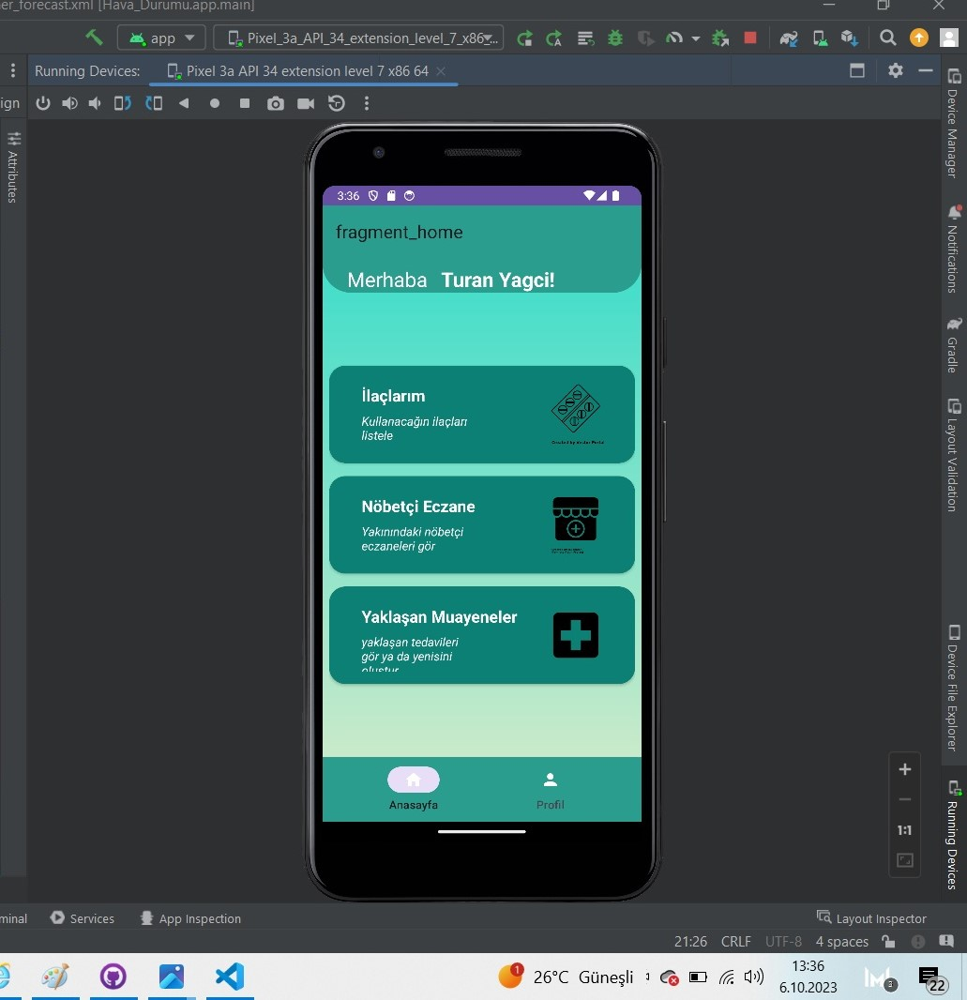
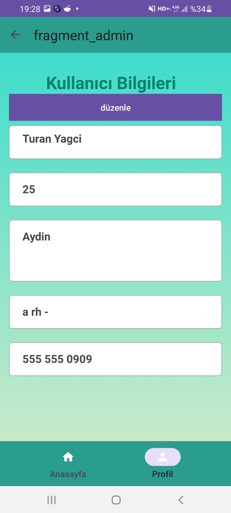
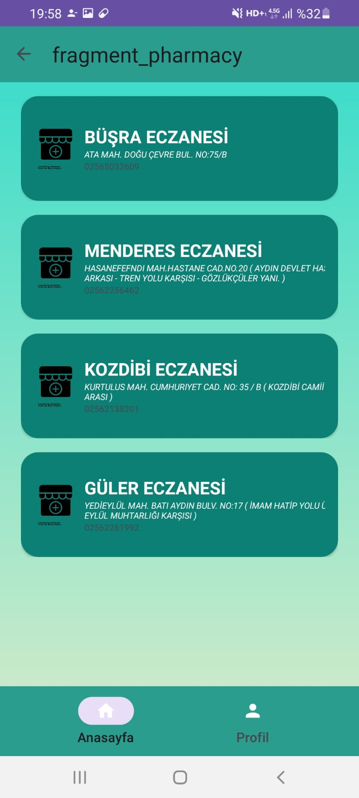
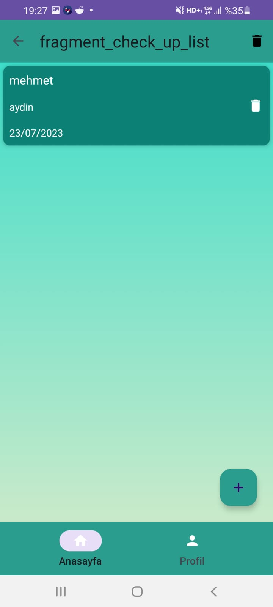
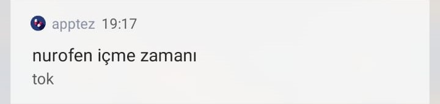

# DrugReminder2
Drug Reminder, ilaç takibi ve doktor randevularını yönetmek için tasarlanmış kapsamlı bir sağlık ve ilaç yönetim uygulamasıdır. Uygulama, kullanıcılara ilaçlarını ve sağlık kontrol tarihlerini takip etme, alarm kurma ve eczanelerle ilgili bilgilere erişme imkanı sağlar.

ÖZELLİKLER

İlaç Takibi: Kullanıcıların ilaçlarını ve alım saatlerini takip etmelerini sağlar.
Doktor Randevuları: Önemli sağlık kontrol tarihlerini takip eder ve hatırlatmalar sağlar.
Eczane Bilgileri: Eczaneler hakkında bilgi edinme imkanı sunar.
Kişisel Sağlık Bilgileri: Kullanıcıların kişisel sağlık bilgilerini kaydetme ve güncelleme özelliği.
Alarm ve Bildirimler: İlaç alma ve doktor randevuları için hatırlatmalar.

KURULUM

Bu uygulamayı kurmak için aşağıdaki adımları takip edin:

Projeyi GitHub'dan klonlayın.

Android Studio'da açın ve gerekli bağımlılıkları yükleyin.
Uygulamayı bir Android cihazda veya emülatörde çalıştırın.

KULLANILAN TEKNOLOJİLER

Kotlin
Android Jetpack (ViewModel, LiveData, Navigation, Room)
Retrofit ve Gson
RxJava ve RxAndroid
Glide
AlarmManager ve BroadcastReceiver
Material Design
Data Binding ve View Binding

